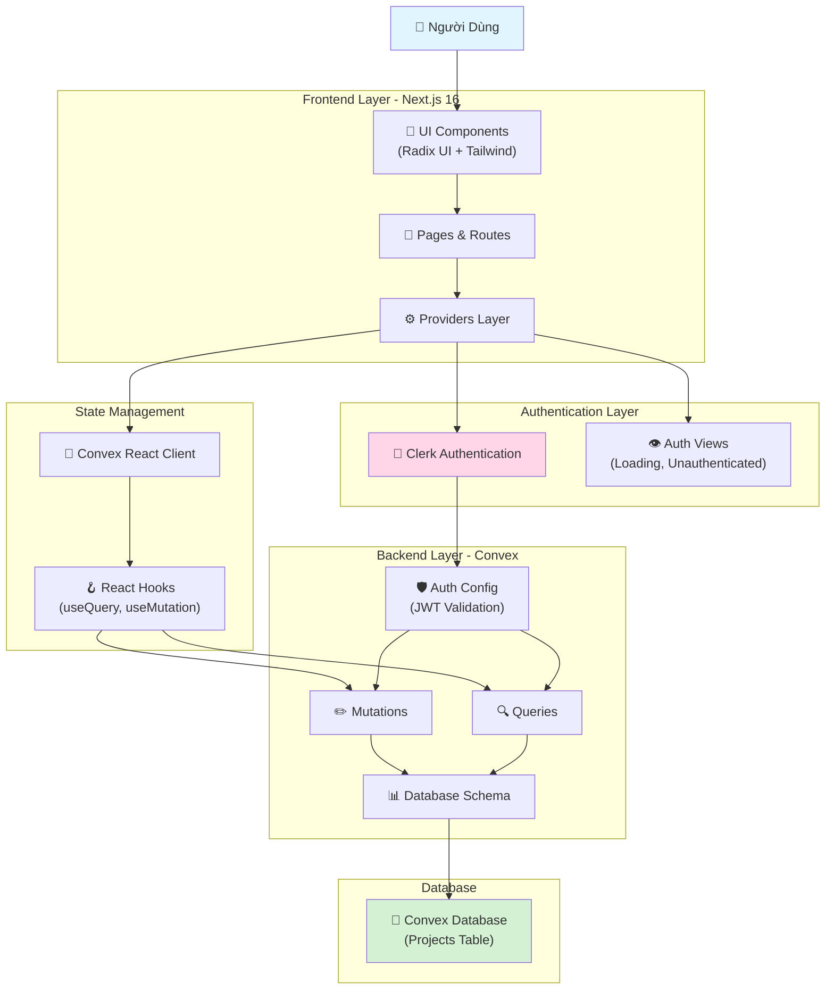
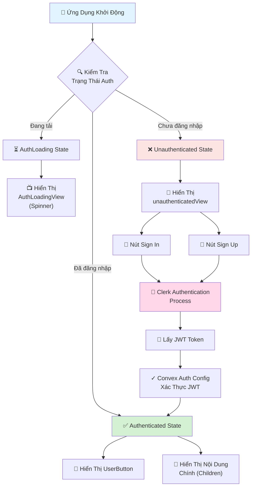
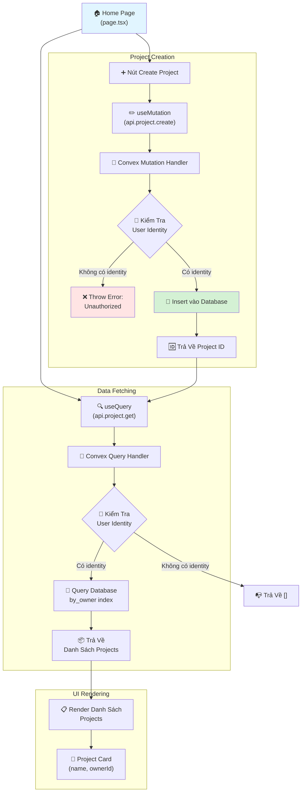
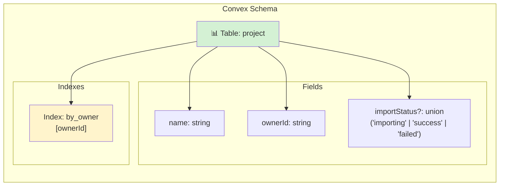
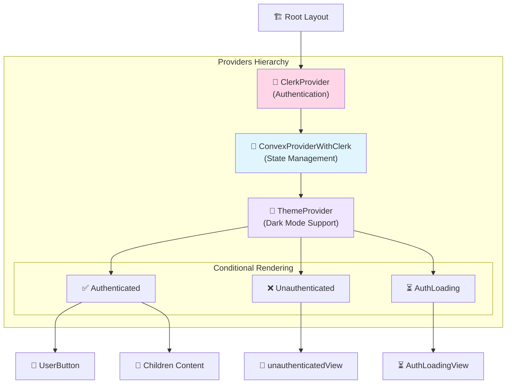
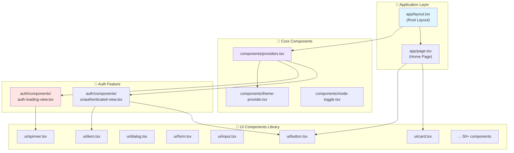
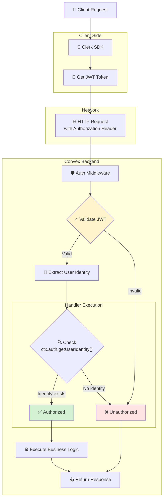

# Business Logic Mindmap - V0 Dev Project

> [!NOTE]
> Tài liệu này mô tả luồng logic nghiệp vụ (business logic flow) của dự án V0 Dev thông qua các sơ đồ mindmap và flowchart.

## Tổng Quan Kiến Trúc Hệ Thống

## Luồng Xác Thực Người Dùng (Authentication Flow)

## Luồng Quản Lý Dự Án (Project Management Flow)

## Cấu Trúc Database Schema

## Cấu Trúc Providers & Context

## Component Architecture

## Security & Authorization Flow

## Tổng Kết Luồng Business Logic

### 🎯 Các Luồng Chính

1. **Authentication Flow**: Clerk → JWT → Convex Auth Config
2. **Data Fetching Flow**: useQuery → Convex Query → Database
3. **Data Mutation Flow**: useMutation → Convex Mutation → Database
4. **Authorization Flow**: JWT Validation → Identity Check → Access Control

### 🔑 Điểm Quan Trọng

- **Real-time Sync**: Convex tự động đồng bộ dữ liệu giữa client và server
- **Type Safety**: TypeScript end-to-end từ frontend đến backend
- **Security**: Mọi request đều được xác thực qua JWT token
- **Scalability**: Serverless architecture với Convex
- **Developer Experience**: Type-safe API, auto-generated types

### 📊 Database Design

- **Single Table**: `project` table với index `by_owner`
- **Owner-based Access**: Mỗi user chỉ thấy projects của mình
- **Import Status**: Tracking trạng thái import dữ liệu

### 🎨 UI/UX Features

- **Dark Mode**: Theme provider với system preference
- **Loading States**: Dedicated loading views
- **Error Handling**: Unauthorized access handling
- **Responsive Design**: Tailwind CSS utilities
