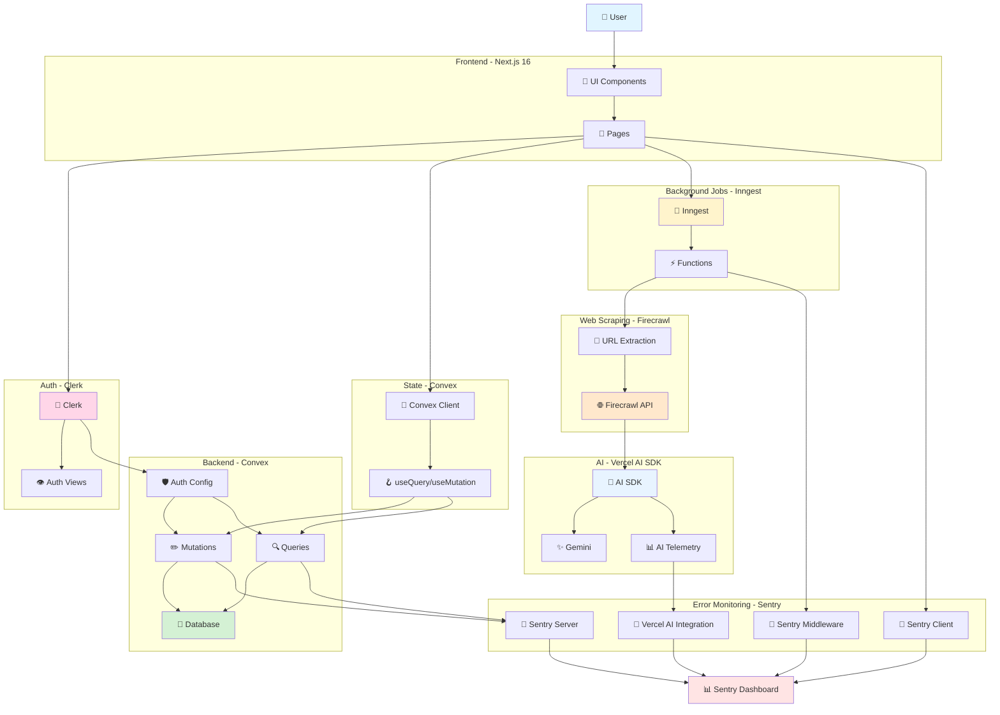
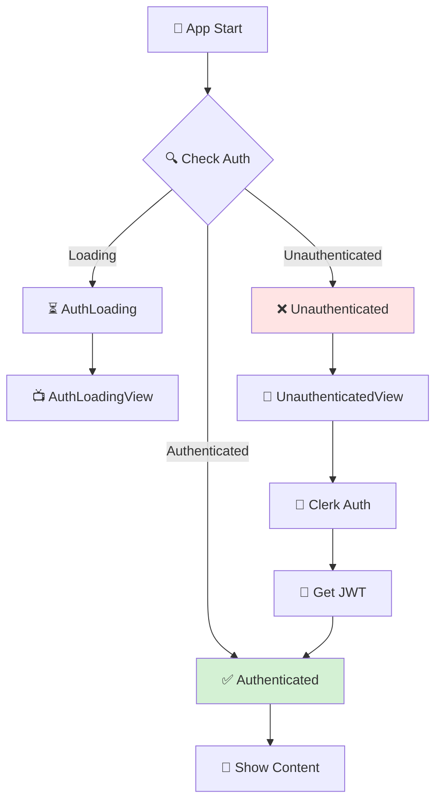
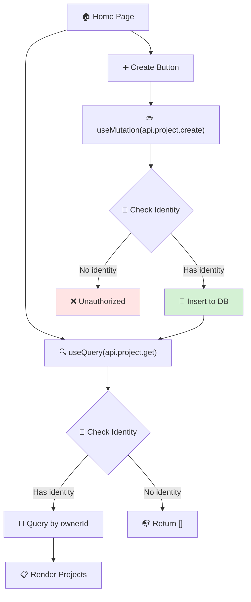
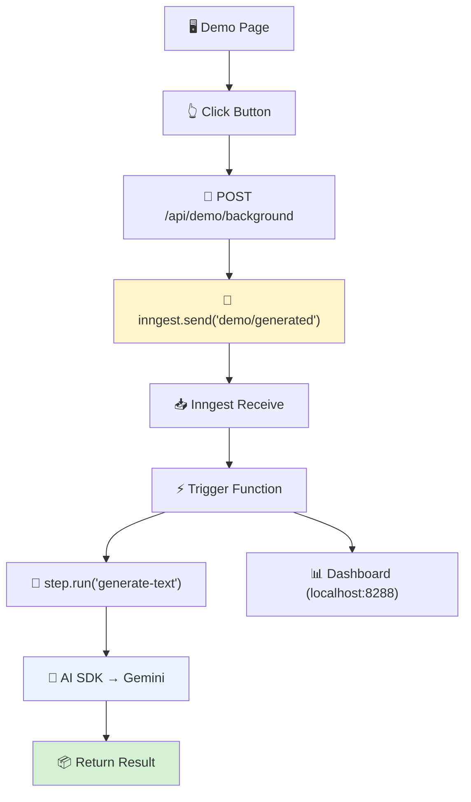
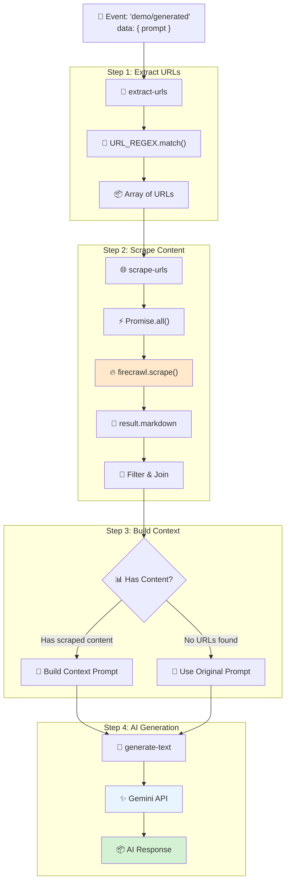
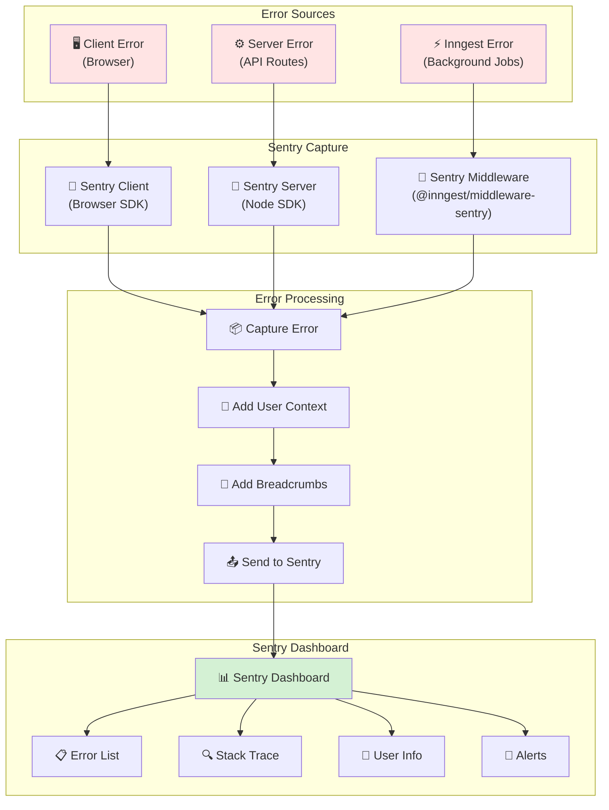
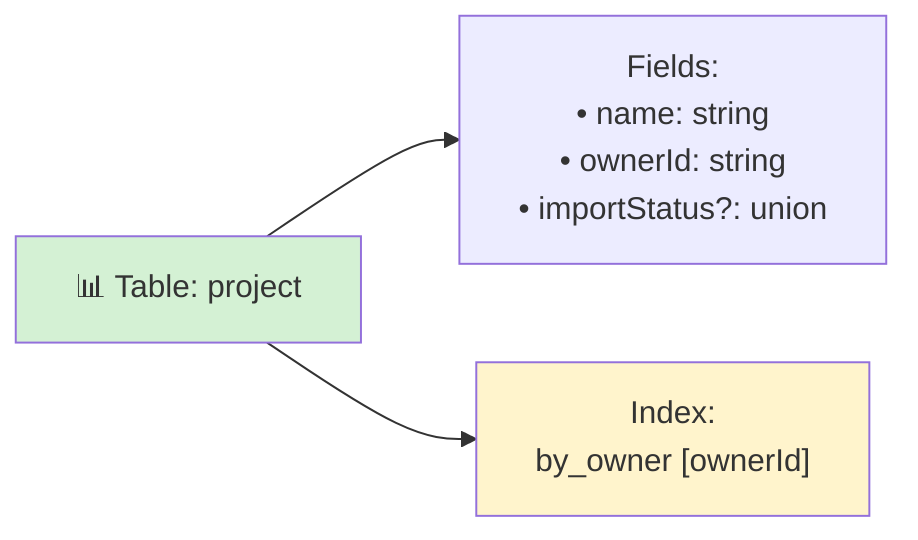
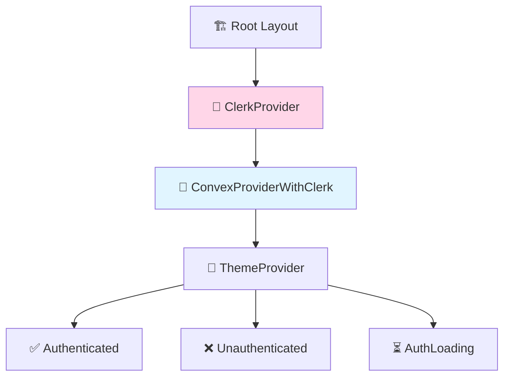

# Business Logic Mindmap - V0 Dev Project

> [!NOTE]
> Tài liệu này mô tả luồng logic nghiệp vụ (business logic flow) của dự án V0 Dev.

## Tổng Quan Kiến Trúc Hệ Thống

## Luồng Authentication

## Luồng Quản Lý Project

## Luồng Background Jobs

## Luồng Web Scraping với Firecrawl

## Luồng Error Monitoring với Sentry

## Database Schema

## Providers Hierarchy

## Tóm tắt

### 🎯 Các Luồng Chính

1. **Authentication**: Clerk → JWT → Convex Auth
2. **Data Fetching**: useQuery → Convex Query → Database
3. **Data Mutation**: useMutation → Convex Mutation → Database
4. **Background Jobs**: Event → Inngest → AI SDK → Result

### 🔑 Tech Stack

- **Frontend**: Next.js 16 + React 19 + TypeScript
- **UI**: Radix UI + Tailwind CSS + shadcn/ui
- **Auth**: Clerk + JWT
- **Database**: Convex (Realtime)
- **Background Jobs**: Inngest
- **Web Scraping**: Firecrawl
- **AI**: Vercel AI SDK + Google Gemini
- **Error Monitoring**: Sentry
- **Theme**: next-themes

### 📊 Database

- **Table**: `project` với index `by_owner`
- **Access**: Owner-based (mỗi user chỉ thấy projects của mình)

### ⚡ Features

- ✅ Real-time sync (Convex)
- ✅ Type-safe end-to-end
- ✅ JWT authentication
- ✅ Background processing (Inngest)
- ✅ Web scraping (Firecrawl)
- ✅ AI integration (Gemini)
- ✅ Context-aware AI responses
- ✅ Error monitoring (Sentry)
- ✅ Dark mode support
