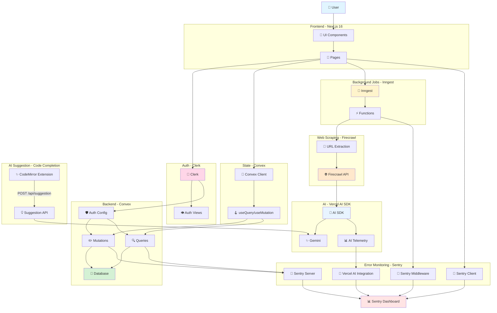
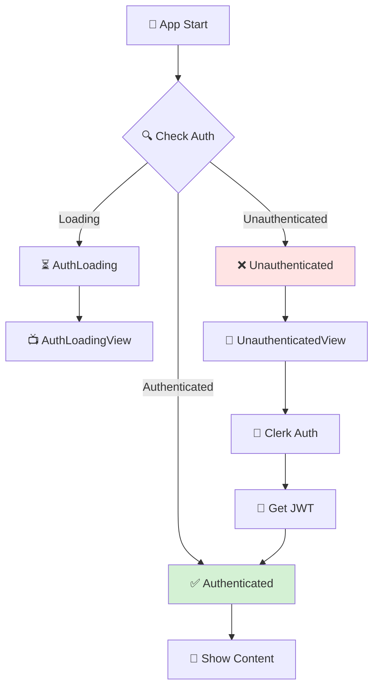
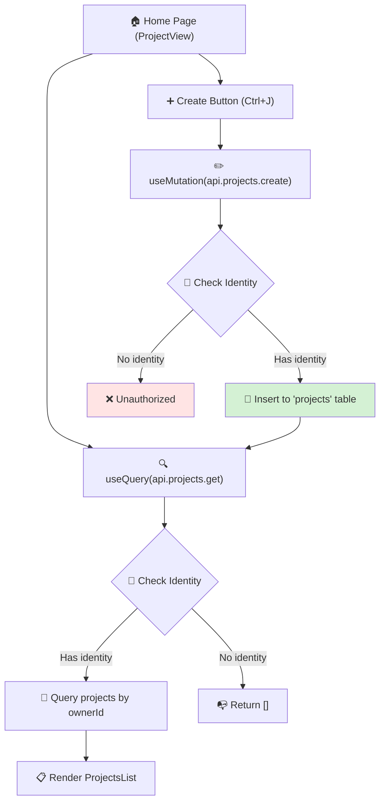
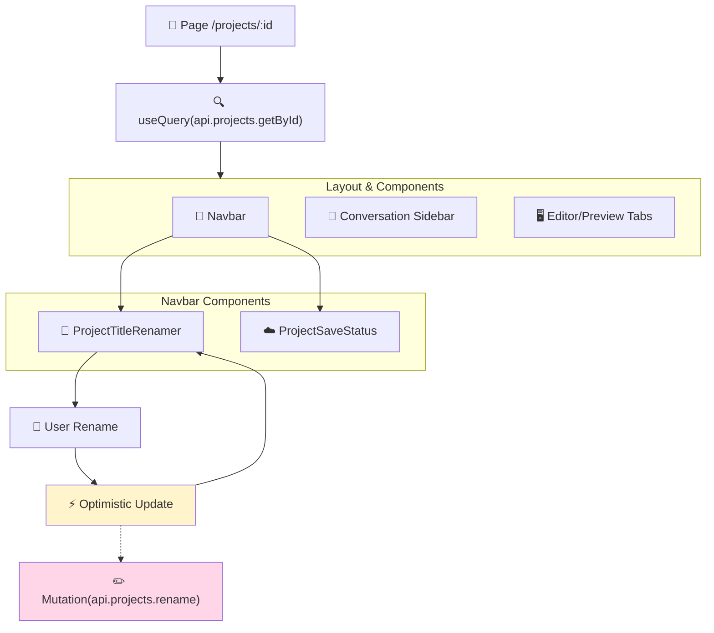
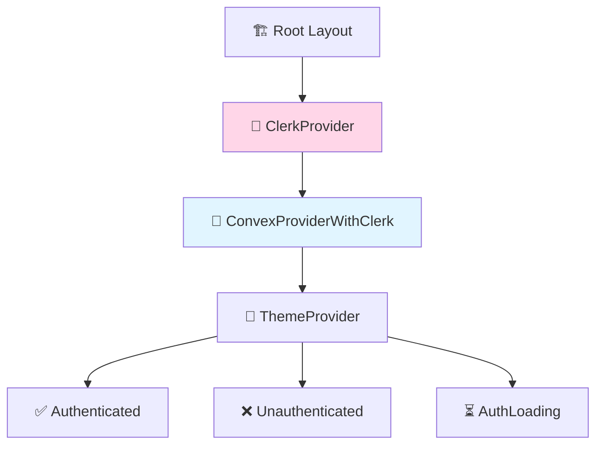
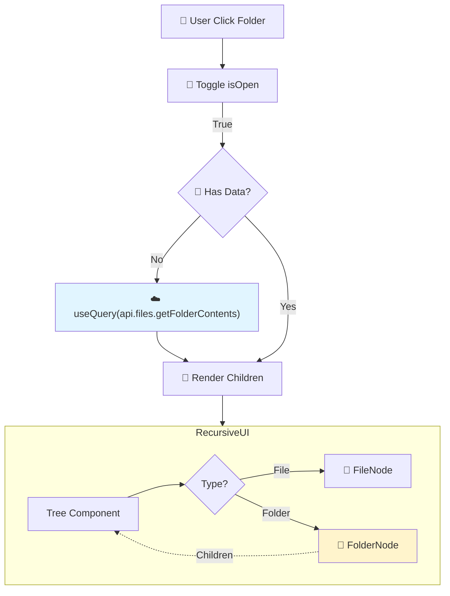
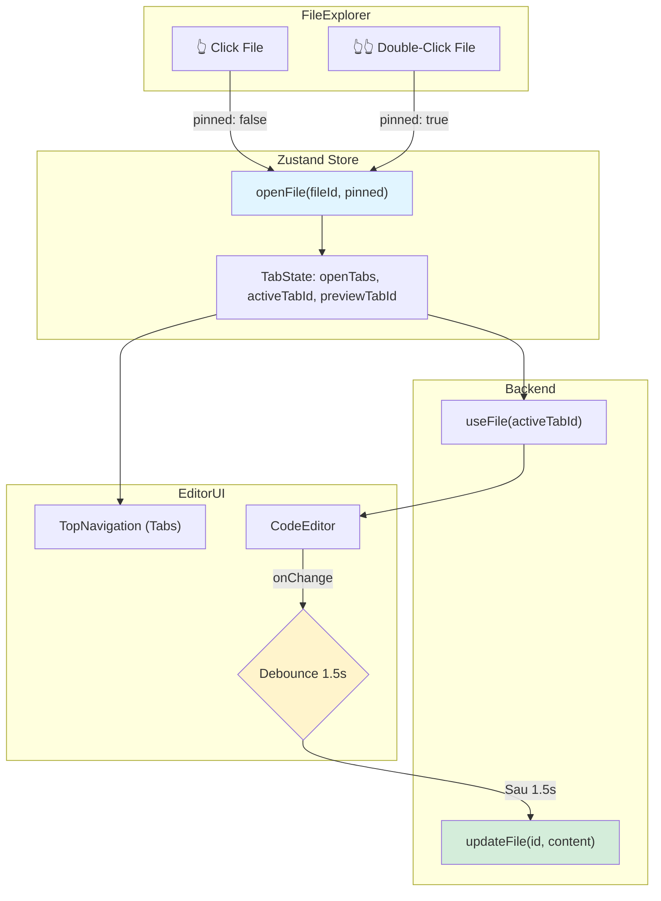
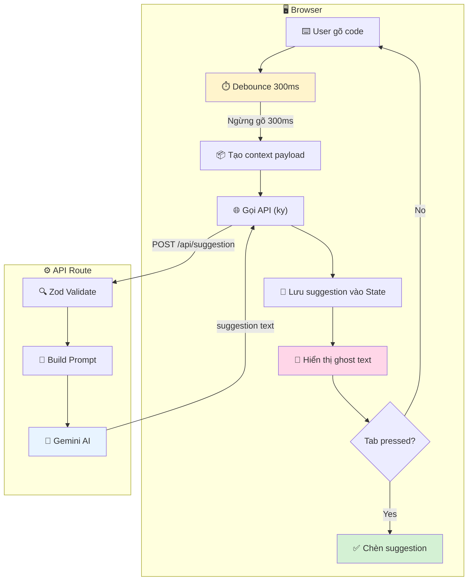

# Business Logic Mindmap - V0 Dev Project

> [!NOTE]
> Tài liệu này mô tả luồng logic nghiệp vụ (business logic flow) của dự án V0 Dev.

## Tổng Quan Kiến Trúc Hệ Thống

## Luồng Authentication

## Luồng Quản Lý Project

## Luồng Chi Tiết Project (Project Detail)

## Database Schema

## Providers Hierarchy

## Luồng Quản Lý File (File Explorer)

## Luồng Code Editor (Tab & Autosave)

## Luồng AI Suggestion (Gợi Ý Code Tự Động)

## Tóm tắt

### 🎯 Các Luồng Chính

1. **Authentication**: Clerk → JWT → Convex Auth
2. **Data Fetching**: useQuery → Convex Query → Database
3. **Data Mutation**: useMutation → Convex Mutation → Database

### 🔑 Tech Stack

- **Frontend**: Next.js 16 + React 19 + TypeScript
- **UI**: Radix UI + Tailwind CSS + shadcn/ui
- **Auth**: Clerk + JWT
- **Database**: Convex (Realtime)
- **Theme**: next-themes

### 📊 Database

- **Table**: `projects` với index `by_owner`
- **Access**: Owner-based (mỗi user chỉ thấy projects của mình)

### ⚡ Features

- ✅ Real-time sync (Convex)
- ✅ Type-safe end-to-end
- ✅ JWT authentication
- ✅ Dark mode support
- ✅ AI Code Suggestion (Gemini + CodeMirror Extension)
