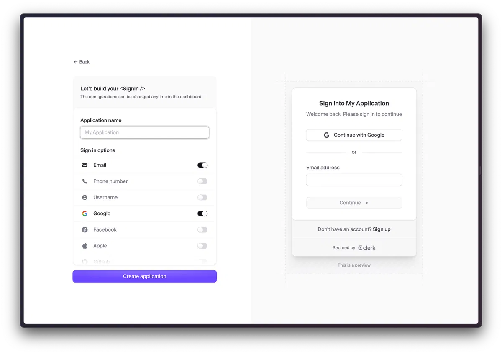
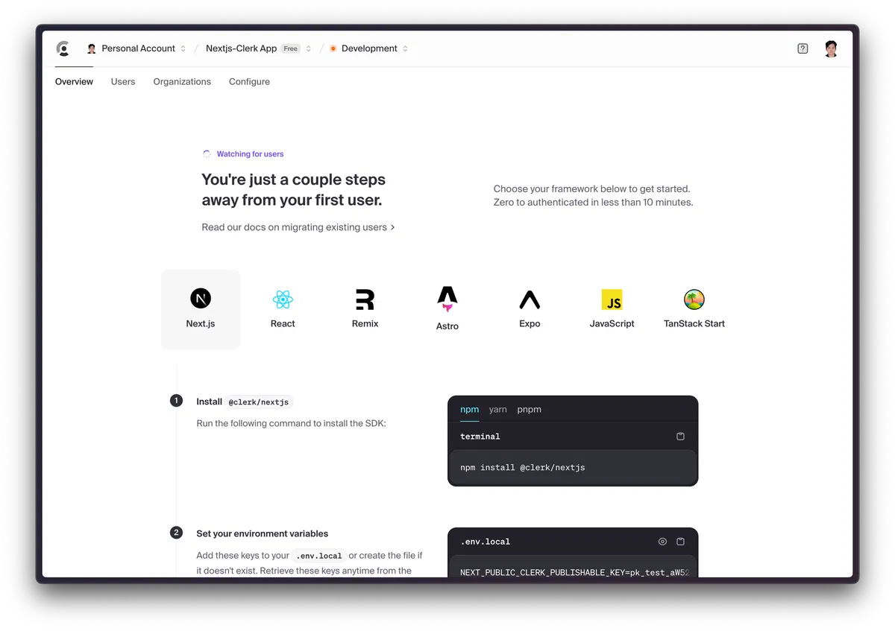

# V0-dev: Authentication (NextJS + Clerk + Clerk-themes)

## 1. Clerk là gì?

- Clerk là dịch vụ chuyên cung cấp giải pháp xác thực (authentication) và quản lý người dùng (user management) được xây dựng dành riêng cho các ứng dụng React và Next.js.

- Với Clerk, bạn có thể triển khai các luồng đăng nhập, đăng ký, xử lý bảo mật (gửi mã OTP qua email/sms), quản lý thông tin hồ sơ người dùng (profile), liên kết tài khoản mạng xã hội (social accounts linking),...

- Clerk là có sẵn UI components được viết riêng cho React, NextJs. Bạn chỉ cần import các component như: `<SignIn />`, `<SignUp />`, `<UserProfile />`,… và chèn vào trang phù hợp. Thay vì phải tự ngồi code từng dòng giao diện hay từng logic khi call API, Clerk cung cấp hầu hết mọi thứ

### 1.1 Tại sao bạn cần Clerk?

- Clerk được thiết kế để hoạt động mượt với NextJs. Việc tích hợp Clerk vào NextJs giống như: "đo ni đóng giày" - chỉ cần vài bước config, một vài "middleware" và "providers" là bạn đã có authentication đầy đủ.

- Clerk đi kèm nhiều components sẵn như: form đăng nhập, đăng ký, profile, trang quản lý mật khẩu,… Theo cảm quan của mình nhận xét thì giao diện components cơ bản khá là đẹp. Bạn có thể sử dụng ngay mà không cần tùy chỉnh quá nhiều.

- Clerk hỗ trợ nhiều phương thức đăng nhập từ email-password, đến đăng nhập thông qua Google, Facebook, GitHub, Twitter,… hay thậm chí passwordless (dùng magic link gửi qua email/sms). Người dùng website của bạn có thể liên kết nhiều tài khoản, thay đổi phương thức đăng nhập theo ý thích.

- Clerk có sẵn các hooks, context, đảm bảo bạn có thể truy cập thông tin người dùng, quản lý session, protect route một cách đơn giản. Đặc biệt hữu ích, quan trọng trong NextJs để render điều kiện (conditional rendering) hay kiểm tra quyền truy cập (authorization checks).

- Không lo lắng về các rủi ro bảo mật người dùng vì Clerk giúp bạn gánh vác mảng này.

### 1.2 Cách thức hoạt động của Clerk

- Khi bạn tạo tài khoản Clerk, bạn sẽ có một Project (hoặc "Application") đại diện cho ứng dụng NextJs của mình. Clerk sẽ cung cấp API Keys và Publishable Keys để bạn sử dụng trong code. Mỗi khi bạn muốn đăng nhập, bạn sẽ dùng các component hoặc API do Clerk cung cấp. Tất cả thao tác như: gửi OTP, xác thực email, liên kết mạng xã hội, lưu trữ session,… đều diễn ra thông qua Clerk.

- Trên NextJs, bạn sẽ cài gói `@clerk/nextjs` (hoặc `@clerk/clerk-react`, tuỳ version), sau đó cấu hình environment variables chứa keys. Bạn cũng cần cấu hình `middleware` (trong NextJs cũ/ `proxy` trong NextJs mới) để Clerk có thể protect route khi chưa xác thực hoặc thực hiện thao tác chuyển hướng khi cần. Về cơ bản, Clerk sẽ cài đặt một số logic "server-side" để trao đổi token, xác thực người dùng và quản lý session. Về phía client, Clerk cung cấp hooks hoặc context để bạn có thể bắt được trạng thái người dùng hiện tại (đang đăng nhập, đã đăng xuất, email là gì, role là gì,...).

### 1.3 Cấu hình Clerk cho dự án

- Đầu tiên, bạn cần đăng ký tài khoản trên Clerk: https://clerk.com/

- Sau khi đăng ký, bạn sẽ được tạo một Project (hoặc "Application") đại diện cho ứng dụng NextJs của mình. Clerk sẽ cung cấp API Keys và Publishable Keys để bạn sử dụng trong code. Mỗi khi bạn muốn đăng nhập, bạn sẽ dùng các component hoặc API do Clerk cung cấp. Tất cả thao tác như: gửi OTP, xác thực email, liên kết mạng xã hội, lưu trữ session,… đều diễn ra thông qua Clerk.



#### 1.3.1 Setup Clerk Dashboard trong

- B1: Đặt tên cho project của bạn. Ví dụ: "V0-dev"

- B2: Chọn hình thức mà bạn muốn áp dụng đăng nhập trong website của mình. Ví dụ: Google, Github, Email,... Đồng thời thì bạn có thể thấy giao diện phía bên tay phải

- B3: Khi bạn đã chắc chắn, chọn "Create application" để khởi tạo và cung cấp cho bạn các keys quan trọng:

- Publishable Key
- Secret Key

- Sau khi create application xong, Clerk sẽ hiển thị các bước để bạn có thể tích hợp Clerk vào framework bạn mong muốn như hình bên dưới.



#### 1.3.2 Cấu hình environment variables trong NextJs (V0-dev)

- B1: Mở terminal và cài đặt thư viện: `npm install @clerk/nextjs`

- B2: Tạo file `.env` trong thư mục gốc của dự án và thêm các biến môi trường sau:

```
NEXT_PUBLIC_CLERK_PUBLISHABLE_KEY=your_publishable_key
CLERK_SECRET_KEY=your_secret_key
```

- B3: Cấu hình middleware (proxy ở bản mới nhất) trong NextJs (V0-dev)

```jsx
import { clerkMiddleware } from "@clerk/nextjs/server";

export default clerkMiddleware();

export const config = {
  matcher: [
    // Bỏ qua các file tĩnh và nội bộ của Next.js
    "/((?!_next|[^?]*\\.(?:html?|css|js(?!on)|jpe?g|webp|png|gif|svg|ttf|woff2?|ico|csv|docx?|xlsx?|zip|webmanifest)).*)",
    // Luôn chạy cho các API Routes
    "/(api|trpc)(.*)",
  ],
};
```

- B4: Cấu hình layout - providers trong NextJs (V0-dev)

```jsx
import { ThemeProvider } from "@/components/theme-provider";
import {
  ClerkProvider,
  SignedIn,
  SignedOut,
  SignInButton,
  SignUpButton,
  UserButton,
} from "@clerk/nextjs";
import { neobrutalism } from "@clerk/themes";
.....

export default function RootLayout({
  children,
}: Readonly<{
  children: React.ReactNode,
}>) {
  return (
    <ClerkProvider>
      <html lang="en" suppressHydrationWarning>
        <head />
        <body className={`${inter.variable} ${plexMono.variable} antialiased`}>
          <ThemeProvider
            attribute="class"
            defaultTheme="dark"
            enableSystem
            disableTransitionOnChange
          >
            <header className="flex justify-between items-center p-4 gap-4 h-16">
              <SignedOut>
                <SignInButton />
                <SignUpButton>
                  <button className="bg-[#6c47ff] text-white rounded-full font-medium text-sm sm:text-base h-10 sm:h-12 px-4 sm:px-5 cursor-pointer">
                    Sign Up
                  </button>
                </SignUpButton>
              </SignedOut>
              <SignedIn>
                <UserButton />
              </SignedIn>
              {children}
            </header>
          </ThemeProvider>
        </body>
      </html>
    </ClerkProvider>
  );
}
```

- Cuối cùng hãy chạy `npm run dev` để chạy dự án

## 2. Custom với Clerk-themes

- `@clerk/themes` là một thư viện bổ trợ chính thức từ Clerk, cung cấp các bộ giao diện được thiết kế sẵn (như Dark, Neobrutalism, Shades of Purple) và các công cụ giúp bạn can thiệp sâu vào giao diện của Clerk mà không cần dùng đến CSS thuần.

- Nó giúp các component của Clerk "thông minh" hơn, có thể nhận biết được theme hiện tại của ứng dụng và thay đổi màu sắc, font chữ, độ bo góc của các nút bấm sao cho khớp hoàn toàn với thiết kế tổng thể của bạn.

- Chạy lệnh `npm install @clerk/themes` để cài đặt thư viện Clerk-themes.

- Để sử dụng Clerk-themes, bạn chỉ cần import theme bạn muốn và cấu hình trong `ClerkProvider` như sau:

```jsx
import { ClerkProvider } from "@clerk/nextjs";
import { dark } from "@clerk/themes";

....
<ClerkProvider
  appearance={{
    baseTheme: dark, // Áp dụng giao diện tối cho toàn bộ Clerk components
  }}
>
...
</ClerkProvider>;
```
