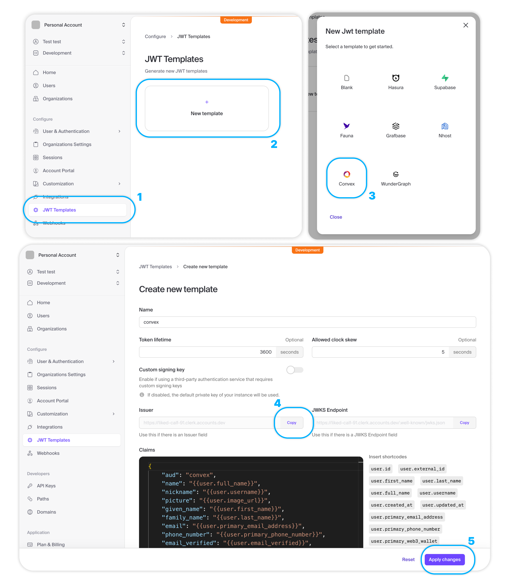

# V0-dev: Tích hợp Convex với Clerk (Authentication + Database)

## 1. Tại sao cần tích hợp Convex với Clerk?

- Trong các ứng dụng thực tế, bạn cần kết hợp **authentication** (xác thực người dùng) với **database** (cơ sở dữ liệu). Clerk cung cấp authentication, trong khi Convex cung cấp database và backend functions.

- Khi tích hợp Convex với Clerk, bạn có thể:
  - **Bảo vệ dữ liệu**: Chỉ cho phép người dùng đã đăng nhập truy cập vào dữ liệu của họ
  - **Phân quyền**: Đảm bảo mỗi người dùng chỉ có thể xem và chỉnh sửa dữ liệu của riêng họ
  - **Tự động đồng bộ**: Khi người dùng đăng nhập/đăng xuất, UI tự động cập nhật
  - **Type-safe**: Có full TypeScript support từ authentication đến database

## 2. Cài đặt Package

### 2.1 Cài đặt convex/react-clerk

- Convex cung cấp package `convex/react-clerk` để tích hợp với Clerk một cách dễ dàng:

```bash
npm install convex
```

> [!NOTE]
> Package `convex/react-clerk` đã được tích hợp sẵn trong package `convex`, bạn không cần cài đặt riêng.

### 2.2 Kiểm tra các package đã cài

- Đảm bảo bạn đã cài đặt các package sau trong `package.json`:

```json
{
  "dependencies": {
    "@clerk/nextjs": "^6.37.1",
    "@clerk/themes": "^2.4.51",
    "convex": "^1.31.7",
    "next": "16.1.6",
    "react": "19.2.3"
  }
}
```

## 3. Cấu hình Clerk JWT Template

### 3.1 Tạo JWT Template trong Clerk Dashboard

- Truy cập Clerk Dashboard: https://dashboard.clerk.com/
- Chọn project của bạn
- Vào **JWT Templates** trong sidebar
- Click **New template**
- Chọn **Convex** từ danh sách templates có sẵn
- Đặt tên cho template: `convex`
- Click **Apply changes**



### 3.2 Lấy Issuer Domain

- Sau khi tạo JWT template, bạn sẽ thấy **Issuer** URL
- Copy URL này, ví dụ: `https://your-clerk-domain.clerk.accounts.dev`

### 3.3 Cấu hình Environment Variables

- Thêm biến môi trường vào Convex Dashboard:
  - Truy cập: https://dashboard.convex.dev/
  - Chọn project của bạn
  - Vào **Settings** → **Environment Variables**
  - Thêm biến: `CLERK_JWT_ISSUER_DOMAIN` với giá trị là Issuer URL từ bước trước

> [!IMPORTANT]
> Bạn cần cấu hình `CLERK_JWT_ISSUER_DOMAIN` trên Convex Dashboard, không phải trong file `.env.local` của Next.js.

## 4. Cấu hình Authentication trong Convex

### 4.1 Tạo file auth.config.ts

- Tạo file `convex/auth.config.ts` để cấu hình authentication:

```typescript
import { AuthConfig } from "convex/server";

export default {
  providers: [
    {
      // Replace with your own Clerk Issuer URL from your "convex" JWT template
      // or with `process.env.CLERK_JWT_ISSUER_DOMAIN`
      // and configure CLERK_JWT_ISSUER_DOMAIN on the Convex Dashboard
      // See https://docs.convex.dev/auth/clerk#configuring-dev-and-prod-instances
      domain: process.env.CLERK_JWT_ISSUER_DOMAIN!,
      applicationID: "convex",
    },
  ],
} satisfies AuthConfig;
```

### 4.2 Giải thích cấu hình

- **providers**: Danh sách các authentication providers (Clerk, Auth0, Firebase, etc.)

- **domain**: Issuer domain từ Clerk JWT template. Convex sẽ sử dụng domain này để verify JWT tokens.

- **applicationID**: Phải là `"convex"` để khớp với tên của JWT template bạn đã tạo trong Clerk.

> [!WARNING]
> `applicationID` phải khớp chính xác với tên của JWT template trong Clerk Dashboard. Nếu bạn đặt tên template khác, hãy thay đổi giá trị này cho phù hợp.

## 5. Tích hợp ConvexProviderWithClerk

### 5.1 Tạo Providers Component

- Thay vì sử dụng `ConvexProvider` và `ClerkProvider` riêng lẻ, chúng ta sẽ sử dụng `ConvexProviderWithClerk` để tích hợp cả hai.

- Tạo file `src/components/providers.tsx`:

```tsx
"use client";

import AuthLoadingView from "@/features/auth/components/auth-loading-view";
import UnanthenticatedView from "@/features/auth/components/unanthenticated-view";
import { ClerkProvider, useAuth, UserButton } from "@clerk/nextjs";
import {
  Authenticated,
  AuthLoading,
  ConvexReactClient,
  Unauthenticated,
} from "convex/react";
import { ConvexProviderWithClerk } from "convex/react-clerk";
import { ReactNode } from "react";
import { ThemeProvider } from "./theme-provider";

if (!process.env.NEXT_PUBLIC_CONVEX_URL) {
  throw new Error("Missing NEXT_PUBLIC_CONVEX_URL in your .env file");
}

const convex = new ConvexReactClient(process.env.NEXT_PUBLIC_CONVEX_URL);

export const Providers = ({ children }: { children: ReactNode }) => {
  return (
    <ClerkProvider>
      <ConvexProviderWithClerk client={convex} useAuth={useAuth}>
        <ThemeProvider
          attribute="class"
          defaultTheme="dark"
          enableSystem
          disableTransitionOnChange
        >
          <Authenticated>
            <UserButton />
            {children}
          </Authenticated>
          <Unauthenticated>
            <UnanthenticatedView />
          </Unauthenticated>
          <AuthLoading>
            <AuthLoadingView />
          </AuthLoading>
        </ThemeProvider>
      </ConvexProviderWithClerk>
    </ClerkProvider>
  );
};
```

### 5.2 Giải thích Components

#### ConvexProviderWithClerk

- **ConvexProviderWithClerk**: Component đặc biệt từ `convex/react-clerk` để tích hợp Convex với Clerk.

- **client**: Instance của `ConvexReactClient` được khởi tạo với `NEXT_PUBLIC_CONVEX_URL`.

- **useAuth**: Hook từ Clerk để lấy thông tin authentication. Convex sẽ sử dụng hook này để tự động gửi JWT token khi gọi functions.

#### Authenticated, Unauthenticated, AuthLoading

- **Authenticated**: Component này chỉ render khi người dùng đã đăng nhập.

- **Unauthenticated**: Component này chỉ render khi người dùng chưa đăng nhập.

- **AuthLoading**: Component này render trong khi đang kiểm tra trạng thái authentication.

> [!TIP]
> Sử dụng `Authenticated`, `Unauthenticated`, và `AuthLoading` giúp bạn dễ dàng quản lý UI dựa trên trạng thái authentication mà không cần viết thêm logic.

### 5.3 Cập nhật Layout

- Mở file `src/app/layout.tsx` và sử dụng `Providers` component:

```tsx
import type { Metadata } from "next";
import { IBM_Plex_Mono, Inter } from "next/font/google";

import { Providers } from "@/components/providers";
import "./globals.css";

const inter = Inter({
  variable: "--font-inter",
  subsets: ["latin"],
});

const plexMono = IBM_Plex_Mono({
  variable: "--font-plex-mono",
  subsets: ["latin"],
  weight: ["400", "500", "600", "700"],
});

export const metadata: Metadata = {
  title: "V0 Dev",
  description: "V0 Dev",
};

export default function RootLayout({
  children,
}: Readonly<{
  children: React.ReactNode;
}>) {
  return (
    <html lang="en" suppressHydrationWarning>
      <head />
      <body className={`${inter.variable} ${plexMono.variable} antialiased`}>
        <Providers>{children}</Providers>
      </body>
    </html>
  );
}
```

## 6. Tạo Authentication Views

### 6.1 Unauthenticated View

- Tạo file `src/features/auth/components/unanthenticated-view.tsx`:

```tsx
import { Button } from "@/components/ui/button";
import {
  Item,
  ItemActions,
  ItemContent,
  ItemDescription,
  ItemMedia,
  ItemTitle,
} from "@/components/ui/item";
import { SignInButton, SignUpButton } from "@clerk/nextjs";
import { ShieldAlertIcon } from "lucide-react";

const UnanthenticatedView = () => {
  return (
    <div className="flex items-center justify-center h-screen bg-background">
      <div className="w-full max-w-lg bg-muted">
        <Item variant={"outline"}>
          <ItemMedia variant={"icon"}>
            <ShieldAlertIcon />
          </ItemMedia>
          <ItemContent>
            <ItemTitle>Unauthorized Access</ItemTitle>
            <ItemDescription>
              You do not have permission to access this page.
            </ItemDescription>
          </ItemContent>
          <ItemActions>
            <SignInButton>
              <Button variant={"outline"}>Sign In </Button>
            </SignInButton>
            <SignUpButton>
              <Button variant={"outline"}>Sign Up</Button>
            </SignUpButton>
          </ItemActions>
        </Item>
      </div>
    </div>
  );
};

export default UnanthenticatedView;
```

### 6.2 Auth Loading View

- Tạo file `src/features/auth/components/auth-loading-view.tsx`:

```tsx
import { Spinner } from "@/components/ui/spinner";

const AuthLoadingView = () => {
  return (
    <div className="flex items-center justify-center h-screen bg-background">
      <Spinner className="size-6 text-ring" />
    </div>
  );
};

export default AuthLoadingView;
```

> [!NOTE]
> Bạn có thể tùy chỉnh giao diện của các views này theo ý muốn. Đây chỉ là ví dụ cơ bản.

## 7. Sử dụng Authentication trong Convex Functions

### 7.1 Truy cập User Identity

- Trong Convex functions, bạn có thể truy cập thông tin người dùng thông qua `ctx.auth.getUserIdentity()`:

```typescript
import { v } from "convex/values";
import { mutation, query } from "./_generated/server";

export const create = mutation({
  args: {
    name: v.string(),
  },
  handler: async (ctx, args) => {
    const identity = await ctx.auth.getUserIdentity();

    if (!identity) {
      throw new Error("Unauthorized");
    }

    return await ctx.db.insert("project", {
      name: args.name,
      ownerId: identity.subject,
    });
  },
});

export const get = query({
  args: {},
  handler: async (ctx) => {
    const identity = await ctx.auth.getUserIdentity();

    if (!identity) {
      return [];
    }

    return await ctx.db
      .query("project")
      .withIndex("by_owner", (q) => q.eq("ownerId", identity.subject))
      .collect();
  },
});
```

### 7.2 Giải thích Code

#### ctx.auth.getUserIdentity()

- **ctx.auth.getUserIdentity()**: Trả về thông tin người dùng từ JWT token.

- **identity.subject**: ID duy nhất của người dùng (từ Clerk). Đây là giá trị bạn nên sử dụng làm `userId` hoặc `ownerId`.

- **identity.email**: Email của người dùng (nếu có).

- **identity.name**: Tên của người dùng (nếu có).

#### Bảo vệ Mutations

- Trong mutation `create`, chúng ta kiểm tra `identity`. Nếu không có (người dùng chưa đăng nhập), throw error `"Unauthorized"`.

- Khi insert document, chúng ta lưu `ownerId` là `identity.subject` để biết document này thuộc về ai.

#### Bảo vệ Queries

- Trong query `get`, nếu người dùng chưa đăng nhập, trả về mảng rỗng `[]`.

- Sử dụng `.withIndex("by_owner", ...)` để chỉ lấy các documents thuộc về người dùng hiện tại.

> [!IMPORTANT]
> Luôn kiểm tra `identity` trong mọi functions để đảm bảo bảo mật. Không bao giờ tin tưởng dữ liệu từ client.

## 8. Cập nhật Schema với Index

### 8.1 Thêm Index cho ownerId

- Để query hiệu quả theo `ownerId`, bạn cần tạo index trong schema:

```typescript
import { defineSchema, defineTable } from "convex/server";
import { v } from "convex/values";

export default defineSchema({
  project: defineTable({
    name: v.string(),
    ownerId: v.string(),
    importStatus: v.optional(
      v.union(v.literal("importing"), v.literal("success"), v.literal("failed"))
    ),
  }).index("by_owner", ["ownerId"]),
});
```

### 8.2 Tại sao cần Index?

- **Performance**: Index giúp Convex tìm kiếm dữ liệu nhanh hơn rất nhiều.

- **Scalability**: Khi có hàng nghìn hoặc hàng triệu documents, query không có index sẽ rất chậm.

- **Best Practice**: Luôn tạo index cho các trường bạn thường xuyên query.

> [!TIP]
> Tạo index cho mọi trường mà bạn sử dụng trong `.withIndex()` hoặc filter thường xuyên.

## 9. Testing Integration

### 9.1 Kiểm tra Flow

1. **Chưa đăng nhập**: Truy cập ứng dụng, bạn sẽ thấy `UnanthenticatedView` với nút Sign In/Sign Up.

2. **Đăng nhập**: Click Sign In, đăng nhập với Clerk. Sau khi đăng nhập thành công, bạn sẽ thấy nội dung chính của ứng dụng.

3. **Tạo dữ liệu**: Tạo một project mới. Dữ liệu sẽ được lưu với `ownerId` là ID của bạn.

4. **Xem dữ liệu**: Chỉ các projects của bạn sẽ được hiển thị.

5. **Đăng xuất**: Click vào `UserButton` và chọn Sign Out. Bạn sẽ quay lại `UnanthenticatedView`.

### 9.2 Kiểm tra trong Convex Dashboard

- Truy cập Convex Dashboard: https://dashboard.convex.dev/
- Vào tab **Data**
- Chọn bảng `project`
- Kiểm tra các documents, bạn sẽ thấy trường `ownerId` chứa ID của người dùng

### 9.3 Kiểm tra Logs

- Trong Convex Dashboard, vào tab **Logs**
- Bạn sẽ thấy logs của các functions được gọi
- Nếu có lỗi authentication, logs sẽ hiển thị chi tiết

## 10. Advanced: Custom Claims

### 10.1 Thêm Custom Claims vào JWT

- Trong Clerk Dashboard, bạn có thể thêm custom claims vào JWT template:

```json
{
  "userId": "{{user.id}}",
  "email": "{{user.primary_email_address}}",
  "role": "{{user.public_metadata.role}}"
}
```

### 10.2 Sử dụng Custom Claims trong Convex

```typescript
export const adminOnlyMutation = mutation({
  args: {},
  handler: async (ctx) => {
    const identity = await ctx.auth.getUserIdentity();

    if (!identity) {
      throw new Error("Unauthorized");
    }

    // Access custom claim
    const role = identity.role;

    if (role !== "admin") {
      throw new Error("Forbidden: Admin only");
    }

    // Admin logic here
  },
});
```

> [!WARNING]
> Custom claims phải được cấu hình trong Clerk JWT template trước khi có thể sử dụng trong Convex.

## 11. Troubleshooting

### 11.1 Lỗi "Unauthorized" khi gọi functions

- **Nguyên nhân**: JWT token không được gửi hoặc không hợp lệ.

- **Giải pháp**:
  - Kiểm tra `CLERK_JWT_ISSUER_DOMAIN` trong Convex Dashboard
  - Kiểm tra JWT template trong Clerk Dashboard có tên là `convex`
  - Đảm bảo `applicationID` trong `auth.config.ts` khớp với tên template

### 11.2 Lỗi "Missing NEXT_PUBLIC_CONVEX_URL"

- **Nguyên nhân**: Environment variable không được cấu hình.

- **Giải pháp**:
  - Chạy `npx convex dev` để tự động tạo `.env.local`
  - Hoặc thêm thủ công vào `.env.local`:
    ```
    NEXT_PUBLIC_CONVEX_URL=https://your-deployment.convex.cloud
    ```

### 11.3 UI không cập nhật sau khi đăng nhập/đăng xuất

- **Nguyên nhân**: Providers không được cấu hình đúng.

- **Giải pháp**:
  - Đảm bảo `ConvexProviderWithClerk` bọc toàn bộ ứng dụng
  - Kiểm tra `useAuth` được truyền vào `ConvexProviderWithClerk`
  - Restart cả `npm run dev` và `npx convex dev`

## 12. Tóm tắt

- **ConvexProviderWithClerk**: Component để tích hợp Convex với Clerk, tự động gửi JWT token khi gọi functions.

- **auth.config.ts**: File cấu hình authentication trong Convex, chỉ định Clerk JWT issuer domain.

- **ctx.auth.getUserIdentity()**: API để lấy thông tin người dùng trong Convex functions.

- **Authenticated/Unauthenticated/AuthLoading**: Components để quản lý UI dựa trên trạng thái authentication.

- **Security**: Luôn kiểm tra authentication và validate input trong Convex functions.

> [!CAUTION]
> Đảm bảo cấu hình `CLERK_JWT_ISSUER_DOMAIN` trên Convex Dashboard và tạo JWT template tên `convex` trong Clerk Dashboard. Nếu không, authentication sẽ không hoạt động.
