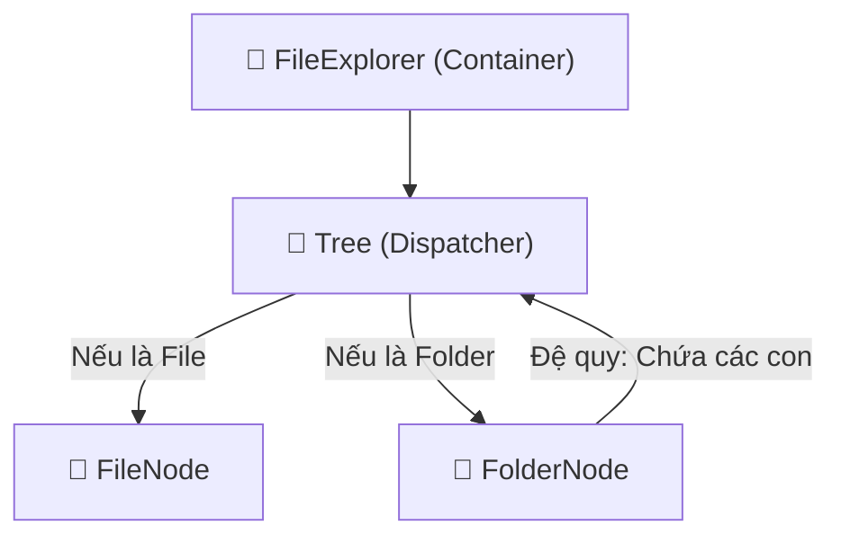
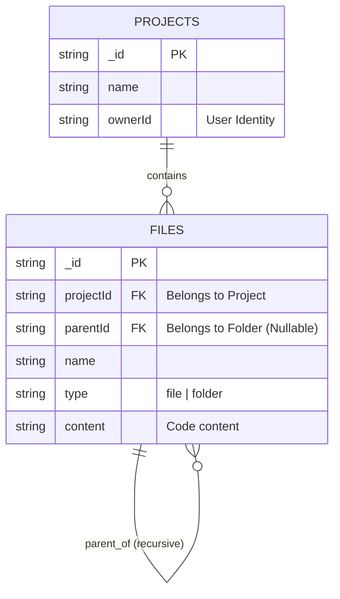

# Hướng Dẫn & Giải Thích Code: File Explorer (Quản Lý Tệp Tin)

> [!NOTE]
> Tài liệu này được viết dành cho người mới bắt đầu (Beginners) để hiểu cách hoạt động của tính năng quản lý file trong dự án.

## 1. Giới Thiệu

Tính năng **File Explorer** giúp người dùng xem, tạo, đổi tên và xóa các file và folder trong dự án giống như trên VSCode.

## 2. Kiến Trúc (Architecture) & Cách Hoạt Động

### 2.1. Cấu Trúc Đệ Quy (Recursion)

File Explorer hoạt động dựa trên cơ chế **Đệ Quy**.

- **Đệ quy là gì?**: Hãy tưởng tượng một cái hộp lớn (Folder). Bên trong hộp đó có thể chứa các món đồ (File) và cả những cái hộp nhỏ hơn (Sub-folder). Những cái hộp nhỏ đó lại có thể chứa tiếp... cứ thế mãi.

### 2.2. Chia Nhỏ Component (SOLID)

Để code dễ quản lý, chúng ta áp dụng nguyên tắc **Single Responsibility Principle (SRP)** - Mỗi component chỉ làm một việc duy nhất.



1.  **`FileExplorer` (`index.tsx`)**:
    - Là cái vỏ ngoài cùng.
    - Quản lý danh sách file/folder ở cấp cao nhất (gốc).
    - Chứa các nút tạo File/Folder mới.

2.  **`Tree` (`tree.tsx`)**:
    - Đóng vai trò là **Người Điều Phối (Dispatcher)**.
    - Khi nhận được 1 item, nó kiểm tra: "Đây là File hay Folder?".
    - Nếu là File -> Gọi `FileNode`.
    - Nếu là Folder -> Gọi `FolderNode`.

3.  **`FileNode` (`file-node.tsx`)**:
    - Chỉ lo việc hiển thị 1 file.
    - Xử lý: Đổi tên file, Xóa file.

4.  **`FolderNode` (`folder-node.tsx`)**:
    - Phức tạp hơn FileNode.
    - Quản lý trạng thái **Đóng/Mở** (Expand/Collapse).
    - Khi mở ra -> Gọi API (`useFolderContents`) để lấy danh sách con bên trong.
    - Hiển thị danh sách con bằng cách gọi lại `Tree` (Đệ quy).

## 3. Luồng Dữ Liệu (Data Flow)

**Lazy Loading (Tải Khi Cần)**:
Chúng ta không tải toàn bộ file của dự án cùng lúc (vì dự án có thể rất lớn). Thay vào đó:

1.  Ban đầu chỉ tải các file ở thư mục gốc.
2.  Khi bạn click mở một Folder -> Lúc đó mới gọi API để tải các file bên trong folder đó.

## 4. Phân Tích Code Chuyên Sâu (Code Deep Dive)

Phần này sẽ giải thích từng dòng code quan trọng để bạn hiểu _tại sao_ chúng lại ở đó.

### 4.1. `Tree.tsx` - Người Điều Phối

File này đóng vai trò như một "nhà ga", phân loại item để đưa về đúng component xử lý.

```typescript
// src/features/projects/components/file-explorer/tree.tsx

export const Tree = ({ item, level = 0, projectId }: TreeProps) => {
  // 1. Kiểm tra loại của item (File hay Folder?)
  if (item.type === "file") {
    // 2. Nếu là File -> Giao cho FileNode xử lý
    // Chúng ta truyền 'level' để FileNode biết nó đang thụt lề bao nhiêu
    return <FileNode item={item} level={level} />;
  }

  // 3. Nếu không phải File thì chắc chắn là Folder -> Giao cho FolderNode
  // Folder cần thêm 'projectId' để có thể load các con bên trong nó
  return <FolderNode item={item} level={level} projectId={projectId} />;
};
```

### 4.2. `FolderNode.tsx` - Trái Tim Của Đệ Quy

Đây là nơi xử lý logic phức tạp nhất: mở folder và hiển thị các file con.

```typescript
// src/features/projects/components/file-explorer/folder-node.tsx

export const FolderNode = ({ item, level, projectId }: FolderNodeProps) => {
  // 1. State 'isOpen': Quản lý việc folder đang Đóng hay Mở
  const [isOpen, setIsOpen] = useState(false);

  // 2. Hook lấy dữ liệu các file con
  // QUAN TRỌNG: 'enabled: isOpen' nghĩa là CHỈ KHI folder mở ra mới gọi API.
  // Đây là kỹ thuật "Lazy Loading" giúp tiết kiệm băng thông.
  const folderContents = useFolderContents({
    projectId,
    parentId: item._id, // Lấy con của folder này
    enabled: isOpen,
  });

  return (
    <>
      {/* 3. Phần hiển thị tên Folder (Action Click để đóng/mở) */}
      <TreeItemWrapper
        item={item}
        level={level}
        onClick={() => setIsOpen((prev) => !prev)} // Đảo ngược trạng thái đóng/mở
        // ... các props khác
      >
        {/* Render Icon Folder và Tên */}
        {folderRender}
      </TreeItemWrapper>

      {/* 4. Phần hiển thị nội dung bên trong (Chỉ hiện khi isOpen = true) */}
      {isOpen && (
        <>
          {/* Nếu đang tải dữ liệu (undefined) -> Hiện Loading */}
          {folderContents === undefined && <LoadingRow level={level + 1} />}

          {/* Duyệt qua từng item con và gọi lại Tree (ĐỆ QUY) */}
          {folderContents?.map((subItem) => (
            <Tree
              key={subItem._id}
              item={subItem}
              level={level + 1} // Tăng level lên 1 để thụt lề sâu hơn
              projectId={projectId}
            />
          ))}
        </>
      )}
    </>
  );
};
```

### 4.3. Logic Backend `convex/files.ts`

Tại sao chúng ta chặn trùng tên file?

```typescript
// convex/files.ts -> createFile mutation

// 1. Tìm tất cả file đang có trong cùng thư mục cha
const files = await ctx.db
  .query("files")
  .withIndex("by_project_parent", (q) =>
    q.eq("projectId", args.projectId).eq("parentId", args.parentId)
  )
  .collect();

// 2. Kiểm tra xem có file nào trùng tên không
const existing = files.find(
  (file) => file.name === args.name && file.type === "file"
);

// 3. Nếu trùng -> Báo lỗi ngay lập tức
if (existing) throw new Error("File already exists");
```

_Mục đích: Đảm bảo tính nhất quán dữ liệu, giống như hệ điều hành không cho phép 2 file trùng tên trong 1 folder._

## 5. Backend & Database (Cấu Trúc Dữ Liệu)

Để File Explorer hoạt động mượt mà, chúng ta cần một thiết kế Database thông minh.

### 5.1. Database Schema (Bảng `files`)

Bảng `files` trong Convex lưu trữ cả File và Folder.

```typescript
// convex/schema.ts
files: defineTable({
  projectId: v.id("projects"), // File này thuộc Project nào?
  parentId: v.optional(v.id("files")), // File này nằm trong Folder nào? (Nếu null -> nằm ở gốc)
  name: v.string(), // Tên file/folder
  type: v.union(v.literal("file"), v.literal("folder")), // Loại
  content: v.optional(v.string()), // Nội dung code (chỉ có ở type="file")
}).index("by_project_parent", ["projectId", "parentId"]);
```

### 5.2. Tại sao cần `parentId`?

Đây là chìa khóa của cấu trúc cây (Tree).

- Nếu `parentId` = `null` -> Item nằm ở thư mục gốc (Root).
- Nếu `parentId` = `"folder_A_id"` -> Item nằm bên trong Folder A.

### 5.3. Chi Tiết Các API Backend (`convex/files.ts`)

Dưới đây là danh sách đầy đủ các luồng xử lý trong Backend:

#### 1. `getFolderContents` (Lấy danh sách file/folder)

- **Input**: `projectId`, `parentId` (có thể null).
- **Logic**:
  - Query bảng `files` với index `by_project_parent`.
  - **Sắp xếp (Sorting)**:
    - Ưu tiên 1: Folder luôn nằm trên cùng.
    - Ưu tiên 2: Sắp xếp theo tên (Alphabet) trong cùng một nhóm.
- **Mục đích**: Giúp giao diện hiển thị giống VSCode.

#### 2. `createFile` & `createFolder` (Tạo mới)

- **Input**: `name`, `parentId`, `projectId`.
- **Validation (Quan Trọng)**:
  - Tìm tất cả file/folder anh em (siblings) trong cùng `parentId`.
  - Nếu đã tồn tại tên trùng -> **Ném lỗi "File/Folder already exists"**.
- **Side Effect**: Cập nhật `updatedAt` của Project chứa nó (để biết project vừa có thay đổi).

#### 3. `renameFile` (Đổi tên)

- **Input**: `id`, `newName`.
- **Validation**:
  - Kiểm tra xem tên mới có bị trùng với file nào khác trong cùng thư mục không?
  - Nếu trùng -> Báo lỗi.
- **Update**: Cập nhật tên file và thời gian update.

#### 4. `updateFile` (Lưu nội dung code)

- **Input**: `id`, `content`.
- **Logic**: Cập nhật trường `content` của file. API này được gọi khi bạn gõ code và auto-save hoặc nhấn Ctrl+S.

#### 5. `deleteFile` (Xóa Đệ Quy - Recursive Delete)

- **Input**: `id`.
- **Logic Phức Tạp**:
  - Nếu xóa 1 File: Xóa bình thường.
  - Nếu xóa 1 Folder:
    1. Tìm tất cả con (children) của folder đó.
    2. Gọi đệ quy `deleteFile` cho từng con.
    3. Sau khi xóa hết con -> Xóa folder cha.
  - **Dọn dẹp**: Nếu file có liên kết với Storage (ảnh, video...), xóa luôn trong Storage.

### 5.4. Mô Hình Quan Hệ (Entity Relationship)

Dưới đây là sơ đồ minh hoạt mối quan hệ giữa `projects` và `files`, cũng như quan hệ đệ quy của `files` (Folder chứa File/Folder con).



## 7. Thư Viện Components & Hooks Support

Ngoài các file chính, File Explorer còn sử dụng nhiều "trợ thủ" đắc lực:

### 7.1. Components Giao Diện (UI)

- **`TreeItemWrapper.tsx`**:
  - Là "lớp vỏ" bao bọc bên ngoài mỗi item (File hoặc Folder).
  - **Nhiệm vụ**: Xử lý click chọn, double-click, và đặc biệt là **Context Menu** (Menu chuột phải) để hiện các tùy chọn: Rename, Delete, New File...
- **`LoadingRow.tsx`**:
  - Hiển thị icon quay (Spinner) khi Folder đang tải dữ liệu từ server về.
- **`constants.ts`**:
  - Chứa công thức tính toán thụt đầu dòng: `padding = base + level * 12px`. Giúp tạo hiệu ứng cây phân cấp rõ ràng.

### 7.2. Components Nhập Liệu (Input)

- **`CreateInput.tsx`**:
  - Hiển thị ô nhập text khi bạn tạo mới.
  - Xử lý: Nhấn `Enter` để lưu, `Escape` để hủy.
- **`RenameInput.tsx`**:
  - Hiển thị ô nhập text khi đổi tên.
  - **Tính năng hay**: Tự động bôi đen phần tên file (bỏ qua đuôi mở rộng `.tsx`) giúp người dùng sửa nhanh hơn.

### 7.3. Custom Hooks (Logic)

- **`use-files.ts`**:
  - Tập hợp các hàm gọi xuống Backend (Convex): `useCreateFile`, `useDeleteFile`...
  - Giúp component chính gọn gàng hơn, không phải viết lại code gọi API nhiều lần.
- **`use-projects.ts`**:
  - Dùng để lấy thông tin Project hiện tại hoặc đổi tên Project.

### 7.4. Layout & Context

- **`ProjectIdView.tsx`**:
  - Khung sườn chính của trang code.
  - Sử dụng thư viện `allotment` để cho phép người dùng kéo thả thay đổi kích thước giữa cột File Explorer và cột Code Editor.
- **`ProjectTitleRenamer.tsx`**:
  - Cho phép click vào tên dự án trên thanh Header để đổi tên trực tiếp.

## 8. Tổng Kết

Việc tách nhỏ code thành `FileNode` và `FolderNode` giúp logic đổi tên, xóa, tạo mới được phân tách rõ ràng. Nếu sau này muốn sửa giao diện File, bạn chỉ cần sửa `file-node.tsx` mà không sợ ảnh hưởng đến Folder.
