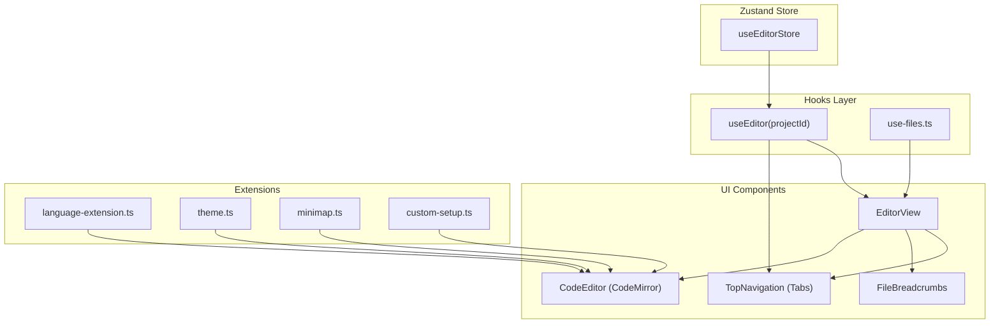
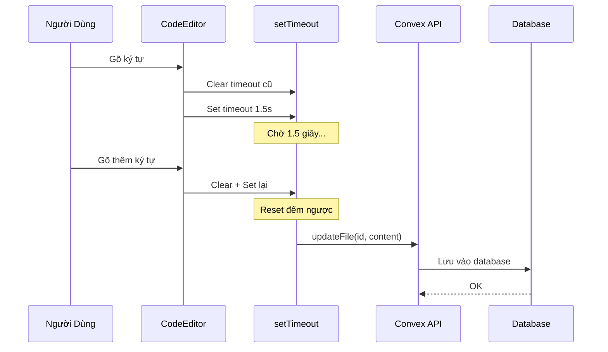

# Hướng Dẫn & Giải Thích Code: Code Editor (Trình Soạn Thảo Code)

> [!NOTE]
> Tài liệu này được viết dành cho người mới bắt đầu (Beginners) để hiểu cách hoạt động của tính năng Code Editor trong dự án.

## 1. Giới Thiệu

Tính năng **Code Editor** cho phép người dùng:

- Mở nhiều file cùng lúc (Tab system)
- Chỉnh sửa code với syntax highlighting
- Auto-save sau khi ngừng gõ 1.5 giây

## 2. Kiến Trúc Tổng Quan



## 3. Giải Thích Chi Tiết Từng File

### 3.1. Store: `use-editor-store.ts`

**Vai trò**: Quản lý trạng thái tab của từng project.

```typescript
// Mỗi project có một TabState riêng
interface TabState {
  openTabs: Id<"files">[]; // Danh sách các file đang mở
  activeTabId: Id<"files"> | null; // File đang active (hiển thị)
  previewTabId: Id<"files"> | null; // File đang xem trước (italic, chưa pin)
}
```

**Các action chính**:
| Action | Mô tả |
|--------|-------|
| `openFile(projectId, fileId, {pinned})` | Mở file. Nếu `pinned=false`, file sẽ ở chế độ preview (ghi đè lên preview cũ). |
| `closeTab(projectId, fileId)` | Đóng tab, tự động chuyển sang tab kế bên. |
| `setActiveTab(projectId, fileId)` | Chuyển sang tab khác. |

**Tại sao dùng Map?**

```typescript
tabs: Map<Id<"projects">, TabState>;
```

Vì mỗi Project có danh sách tab riêng. Khi bạn mở Project A có 3 tab, sau đó mở Project B, khi quay lại A vẫn thấy 3 tab cũ.

---

### 3.2. Hook: `use-editor.ts`

**Vai trò**: Cung cấp API đơn giản cho component, ẩn đi chi tiết store.

```typescript
export const useEditor = (projectId) => {
  const store = useEditorStore();
  const tabState = useEditorStore((state) => state.getTabState(projectId));

  // Wrap các actions, tự động truyền projectId
  const openFile = useCallback((fileId, options) => {
    store.openFile(projectId, fileId, options);
  }, [projectId]);

  return { openTabs, activeTabId, previewTabId, openFile, closeTab, ... };
};
```

**Lợi ích SRP**: Component không cần biết store hoạt động ra sao, chỉ cần gọi `openFile(fileId, {pinned: true})`.

---

### 3.3. Component: `EditorView.tsx`

**Vai trò**: Container chính, quản lý layout Editor.

```typescript
const DEBOUNCE_MS = 1500; // Chờ 1.5 giây sau khi ngừng gõ mới lưu

export const EditorView = ({ projectId }) => {
  const { activeTabId } = useEditor(projectId);
  const activeFile = useFile(activeTabId);      // Lấy nội dung file từ Convex
  const updateFile = useUpdateFile();           // Mutation để lưu file
  const timeoutRef = useRef<NodeJS.Timeout>();  // Lưu ID của setTimeout

  return (
    <div>
      <TopNavigation projectId={projectId} />   {/* Thanh tabs */}
      <FileBreadcrumbs projectId={projectId} /> {/* Đường dẫn file */}

      {isActiveFileText && (
        <CodeEditor
          fileName={activeFile.name}
          initialValue={activeFile.content}
          onChange={(content) => {
            // Clear timeout cũ (nếu đang đếm)
            if (timeoutRef.current) clearTimeout(timeoutRef.current);

            // Đặt timeout mới: sau 1.5s sẽ gọi API lưu
            timeoutRef.current = setTimeout(() => {
              updateFile({ id: activeFile._id, content });
            }, DEBOUNCE_MS);
          }}
        />
      )}
    </div>
  );
};
```

**Tại sao cần Debounce?**

- Nếu gõ 100 ký tự, sẽ trigger 100 lần `onChange`.
- Debounce giúp chỉ gọi API 1 lần sau khi ngừng gõ.

---

### 3.4. Component: `CodeEditor.tsx`

**Vai trò**: Wrapper cho thư viện CodeMirror.

```typescript
export const CodeEditor = ({ fileName, initialValue, onChange }) => {
  const editorRef = useRef<HTMLDivElement>(null);

  // Tự động chọn extension dựa theo đuôi file
  const languageExtension = useMemo(() => {
    return getLanguageExtension(fileName); // .tsx -> JSX+TypeScript
  }, [fileName]);

  useEffect(() => {
    const view = new EditorView({
      doc: initialValue,
      parent: editorRef.current,
      extensions: [
        oneDark,              // Theme màu tối
        customTheme,          // Tuỳ chỉnh font, kích thước
        customSetup,          // Line numbers, fold, autocomplete...
        languageExtension,    // Syntax highlighting theo ngôn ngữ
        minimap(),            // Bản đồ mini bên phải
        EditorView.updateListener.of((update) => {
          if (update.docChanged) onChange(update.state.doc.toString());
        }),
      ],
    });

    return () => view.destroy(); // Cleanup khi unmount
  }, [languageExtension]);

  return <div ref={editorRef} />;
};
```

---

### 3.5. Extensions (Mở Rộng)

Các file trong `extensions/` giúp tách biệt cấu hình CodeMirror:

| File                    | Chức năng                                                             |
| ----------------------- | --------------------------------------------------------------------- |
| `language-extension.ts` | Xác định ngôn ngữ từ đuôi file (.tsx, .py, .css...)                   |
| `theme.ts`              | Tuỳ chỉnh font, outline, scrollbar                                    |
| `custom-setup.ts`       | Tập hợp các tính năng: line numbers, fold gutter, bracket matching... |
| `minimap.ts`            | Hiển thị bản đồ mini của code ở bên phải                              |

---

### 3.6. Component: `TopNavigation.tsx`

**Vai trò**: Hiển thị thanh tabs.

```typescript
const Tab = ({ fileId, projectId }) => {
  const file = useFile(fileId);    // Lấy tên file
  const { activeTabId, previewTabId, setActiveTab, openFile, closeTab } = useEditor(projectId);

  const isActive = activeTabId === fileId;
  const isPreview = previewTabId === fileId; // Tab preview hiển thị italic

  return (
    <div
      onClick={() => setActiveTab(fileId)}           // Click -> active
      onDoubleClick={() => openFile(fileId, {pinned: true})} // Double-click -> pin
    >
      <FileIcon fileName={file.name} />
      <span className={isPreview && "italic"}>{file.name}</span>
      <button onClick={(e) => { e.stopPropagation(); closeTab(fileId); }}>
        <XIcon />
      </button>
    </div>
  );
};
```

**Preview vs Pinned Tab**:

- **Preview (Italic)**: Click 1 lần trên file trong File Explorer -> Mở preview. Mở file khác sẽ thay thế.
- **Pinned (Thường)**: Double-click -> Tab được ghim, không bị thay thế.

---

## 4. Backend & Database

### 4.1. API Mới

| Mutation/Query            | Mô tả                                                   |
| ------------------------- | ------------------------------------------------------- |
| `getFile(id)`             | Lấy thông tin 1 file (name, content)                    |
| `getFilePath(id)`         | Lấy đường dẫn đầy đủ từ root đến file (cho Breadcrumbs) |
| `updateFile(id, content)` | Cập nhật nội dung file (gọi khi autosave)               |

### 4.2. Luồng Lưu File (Autosave)



---

## 5. Tổng Kết

| Thành phần       | Trách nhiệm                              |
| ---------------- | ---------------------------------------- |
| `useEditorStore` | Quản lý state tabs (Zustand)             |
| `useEditor`      | Hook wrapper giúp component dễ sử dụng   |
| `EditorView`     | Container layout + autosave logic        |
| `CodeEditor`     | Render CodeMirror                        |
| `TopNavigation`  | Hiển thị thanh tabs                      |
| `extensions/*`   | Cấu hình CodeMirror (theme, language...) |

**Nguyên tắc SOLID đã áp dụng**:

- **S**ingle Responsibility: Mỗi file làm 1 việc
- **O**pen/Closed: Thêm ngôn ngữ mới chỉ cần sửa `language-extension.ts`
- **D**ependency Inversion: Component dùng hook, không import store trực tiếp
