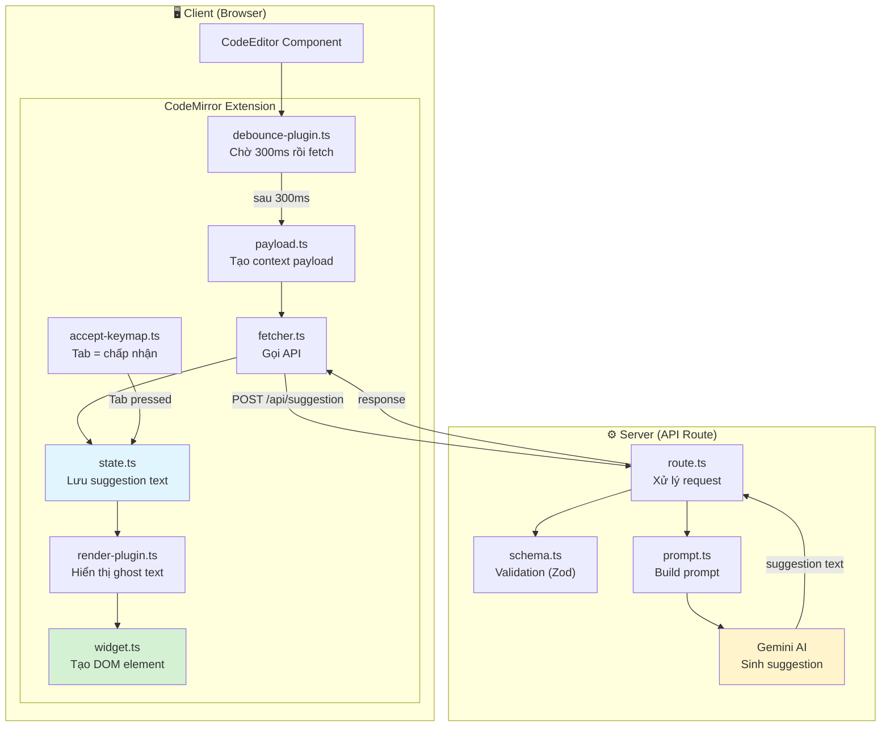

# 12. AI Suggestion Feature (Gợi ý code tự động)

> [!NOTE]
> Hướng dẫn này giải thích cách hoạt động của AI Suggestion — tính năng gợi ý code tự động (giống GitHub Copilot) trong editor.

## Tổng Quan

Khi bạn gõ code trong editor, hệ thống sẽ:

1. **Chờ 300ms** sau khi bạn ngừng gõ (debounce)
2. **Gửi context** (code xung quanh v0dev) lên API
3. **AI sinh suggestion** dựa trên context
4. **Hiển thị ghost text** (chữ mờ) tại vị trí v0dev
5. Nhấn **Tab** → chấp nhận suggestion, chèn vào code

## Kiến Trúc



## Cấu Trúc Thư Mục

```
src/
├── app/api/suggestion/          # Server-side
│   ├── route.ts                 # API endpoint (POST)
│   ├── schema.ts                # Zod schema (shared client/server)
│   └── prompt.ts                # Prompt template + builder
│
└── features/editor/extensions/suggestion/  # Client-side
    ├── index.ts                 # Barrel file (kết hợp tất cả)
    ├── state.ts                 # StateEffect + StateField
    ├── widget.ts                # SuggestionWidget (ghost text DOM)
    ├── payload.ts               # Tạo payload từ editor context
    ├── fetcher.ts               # Gọi API bằng ky
    ├── debounce-plugin.ts       # Debounce + trigger fetch
    ├── render-plugin.ts         # Render ghost text decoration
    └── accept-keymap.ts         # Tab để chấp nhận
```

## Giải Thích Chi Tiết Từng File

### 1. `schema.ts` — Validation chung (Server + Client)

> [!TIP]
> File này được **shared** giữa server và client để đảm bảo type-safety end-to-end.

```typescript
// Zod schema định nghĩa dữ liệu request gửi lên API
export const suggestionRequestSchema = z.object({
  fileName: z.string(), // Tên file đang edit
  code: z.string(), // Toàn bộ code
  currentLine: z.string(), // Dòng hiện tại
  previousLines: z.string(), // 5 dòng phía trước
  textBeforeV0dev: z.string(), // Text trước v0dev trên dòng hiện tại
  textAfterV0dev: z.string(), // Text sau v0dev trên dòng hiện tại
  nextLines: z.string(), // 5 dòng phía sau
  lineNumber: z.number(), // Số dòng hiện tại
});

// Zod schema cho response từ AI
export const suggestionResponseSchema = z.object({
  suggestion: z.string(),
});

// Type infer tự động từ schema → dùng trong TypeScript
export type SuggestionRequest = z.infer<typeof suggestionRequestSchema>;
export type SuggestionResponse = z.infer<typeof suggestionResponseSchema>;
```

**Tại sao shared?** Vì client (`fetcher.ts`) validate payload trước khi gửi, và server (`route.ts`) validate lại khi nhận. Dùng chung 1 schema đảm bảo không bị lệch type.

---

### 2. `state.ts` — Quản lý trạng thái suggestion

```typescript
// StateEffect = "message" để cập nhật state
const setSuggestionEffect = StateEffect.define<string | null>();

// StateField = "nơi lưu trữ" suggestion text
const suggestionState = StateField.define<string | null>({
  create() {
    return null;
  }, // Khởi tạo: không có suggestion
  update(value, transaction) {
    for (const effect of transaction.effects) {
      if (effect.is(setSuggestionEffect)) {
        return effect.value; // Có effect mới → cập nhật
      }
    }
    return value; // Không có → giữ nguyên
  },
});
```

**Ví dụ trực quan:**

```
Bạn gõ "cons" → debounce chờ 300ms → AI trả về "t myVar = 42;"
→ dispatch setSuggestionEffect.of("t myVar = 42;")
→ suggestionState cập nhật thành "t myVar = 42;"
→ renderPlugin đọc state này → hiển thị ghost text
```

---

### 3. `payload.ts` — Tạo context payload

Hàm `generatePayload()` trích xuất thông tin từ editor:

```
Dòng 1: import React from 'react';
Dòng 2:
Dòng 3: const App = () => {
Dòng 4:   return (
Dòng 5:     <div>Hel|lo</div>     ← v0dev ở đây (|)
Dòng 6:   );
Dòng 7: };
```

→ Payload gửi lên API:

```json
{
  "fileName": "App.tsx",
  "currentLine": "    <div>Hello</div>",
  "textBeforeV0dev": "    <div>Hel",
  "textAfterV0dev": "lo</div>",
  "previousLines": "import React...\n\nconst App...\n  return (",
  "nextLines": "  );\n};",
  "lineNumber": 5
}
```

---

### 4. `debounce-plugin.ts` — Debounce + Fetch

```
Bạn gõ "c" → timer bắt đầu (300ms)
Bạn gõ "o" → timer reset (300ms mới)
Bạn gõ "n" → timer reset (300ms mới)
Bạn gõ "s" → timer reset (300ms mới)
[300ms trôi qua, bạn ngừng gõ]
→ generatePayload() → fetcher() → API → suggestion text
```

> [!IMPORTANT]
> **Cải thiện SOLID**: Mutable state (`debounceTimer`, `abortController`) nằm trong **class instance** thay vì module-level variables. Nếu có nhiều editor instances, mỗi cái sẽ có timer riêng.

---

### 5. `render-plugin.ts` — Hiển thị ghost text

Khi `suggestionState` có giá trị (không null):

- Tạo `SuggestionWidget` với text suggestion
- Dán widget vào vị trí v0dev dưới dạng `Decoration`
- Ghost text hiển thị với opacity 0.4 (chữ mờ)

---

### 6. `accept-keymap.ts` — Nhấn Tab để chấp nhận

```
Trước khi nhấn Tab:
  const myVar = |42;        ← v0dev (|), ghost text "42;"

Sau khi nhấn Tab:
  const myVar = 42;|        ← ghost text được chèn, v0dev di chuyển
```

---

### 7. `prompt.ts` — Xây dựng prompt cho AI

Dùng template string với các placeholder (`{fileName}`, `{code}`, etc.) và hàm `buildSuggestionPrompt()` thay thế chúng bằng giá trị thực từ payload.

---

### 8. `route.ts` — API endpoint

Luồng xử lý:

1. **Auth check** → Clerk verify userId
2. **Validate body** → Zod parse request body
3. **Build prompt** → Thay placeholder bằng context
4. **AI generate** → Gemini tạo suggestion
5. **Return** → JSON response với suggestion text

---
