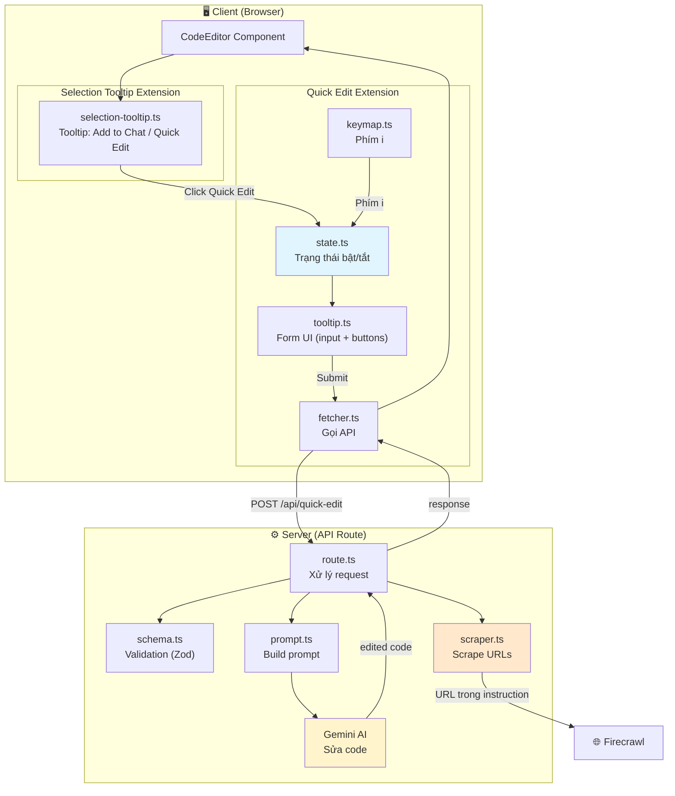
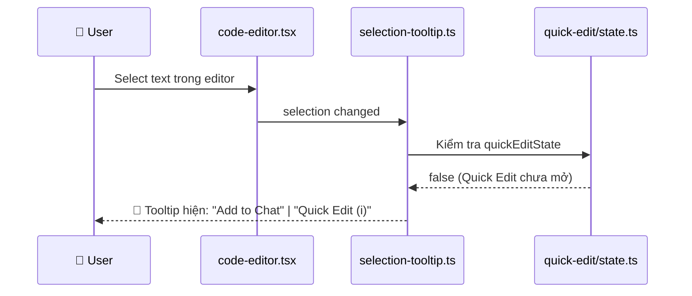
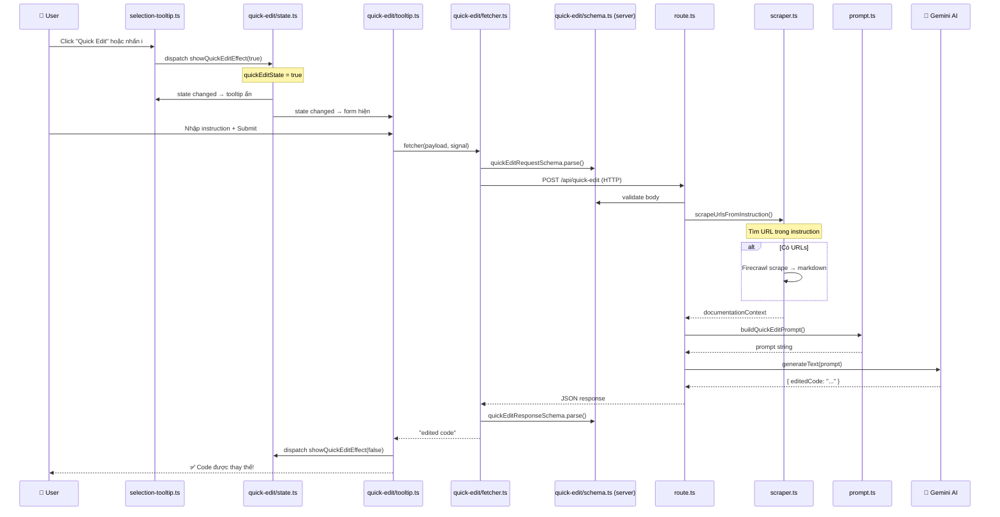
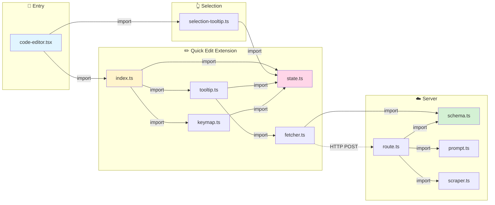

# 13. Quick Edit Feature (Sửa code bằng AI)

> [!NOTE]
> Hướng dẫn này giải thích cách hoạt động của Quick Edit — tính năng cho phép user select code, nhập instruction, và AI sẽ sửa code theo yêu cầu.

## Tổng Quan

Khi bạn select một đoạn code trong editor:

1. **Tooltip xuất hiện** với 2 nút: "Add to Chat" và "Quick Edit"
2. Nhấn nút **Quick Edit** (hoặc phím **i**) → form input mở ra
3. **Nhập instruction** (ví dụ: "thêm error handling", "refactor thành async")
4. Nhấn **Submit** → AI sửa code → code được thay thế tự động

> [!TIP]
> Nếu instruction chứa URL (ví dụ: link tới documentation), hệ thống sẽ tự động scrape nội dung URL đó và đưa vào context cho AI hiểu rõ hơn.

## Kiến Trúc



## Cấu Trúc Thư Mục

```
src/
├── app/api/quick-edit/                   # Server-side
│   ├── route.ts                          # API endpoint (POST)
│   ├── schema.ts                         # Zod schema (shared client/server)
│   ├── prompt.ts                         # Prompt template + builder
│   └── scraper.ts                        # URL scraping (Firecrawl)
│
└── features/editor/extensions/
    ├── selection-tooltip.ts              # Tooltip khi select text
    └── quick-edit/                       # Quick Edit extension
        ├── index.ts                      # Barrel file
        ├── state.ts                      # StateEffect + StateField
        ├── tooltip.ts                    # Form UI (DOM creation)
        ├── keymap.ts                     # Phím tắt i
        └── fetcher.ts                    # Gọi API bằng ky
```

## Luồng Chạy Code Chi Tiết (File → File)

### Luồng 1: Selection → Tooltip xuất hiện



### Luồng 2: Quick Edit form → AI sửa code



### Tổng hợp: File nào import file nào?



> [!TIP]
> `selection-tooltip.ts` import `quickEditState` và `showQuickEditEffect` từ `quick-edit/state.ts` để kiểm tra trạng thái và toggle Quick Edit.

## Giải Thích Chi Tiết Từng File

### 1. `schema.ts` — Validation chung

```typescript
// Request: client gửi lên server
export const quickEditRequestSchema = z.object({
  selectedCode: z.string(), // Code đã select
  fullCode: z.string(), // Toàn bộ code file
  instruction: z.string(), // Instruction từ user
});

// Response: server trả về
export const quickEditResponseSchema = z.object({
  editedCode: z.string(), // Code đã sửa bởi AI
});
```

---

### 2. `state.ts` — Trạng thái bật/tắt Quick Edit

```typescript
// Effect: toggle quick edit on/off
export const showQuickEditEffect = StateEffect.define<boolean>();

// State: true = form đang mở, false = form đóng
export const quickEditState = StateField.define<boolean>({
  create() {
    return false;
  },
  update(value, transaction) {
    // Kiểm tra effect
    for (const effect of transaction.effects) {
      if (effect.is(showQuickEditEffect)) return effect.value;
    }
    // Auto-close khi selection empty
    if (transaction.selection?.main.empty) return false;
    return value;
  },
});
```

**Điểm quan trọng**: State auto-reset về `false` khi user click ra ngoài (selection trống).

---

### 3. `tooltip.ts` — Form UI

Tạo form DOM trực tiếp (không dùng React) vì CodeMirror tooltip yêu cầu vanilla DOM:

```
┌──────────────────────────────┐
│ [Edit selected code       ]  │  ← input
│ [Cancel]            [Submit] │  ← buttons
└──────────────────────────────┘
```

> [!IMPORTANT]
> `editorView` được truyền qua `getView()` callback thay vì module-level global → an toàn khi có nhiều editor instances.

---

### 4. `scraper.ts` — Scrape URL từ instruction

```
User nhập: "refactor theo https://react.dev/learn/hooks → thêm useEffect"
                              ↑ URL detected!

scraper.ts sẽ:
1. Regex match URL: ["https://react.dev/learn/hooks"]
2. Gọi Firecrawl API → lấy markdown content
3. Wrap vào <documentation> tag → gửi cho AI
```

---

### 5. `keymap.ts` — Phím tắt

| Phím | Điều kiện        | Hành động              |
| ---- | ---------------- | ---------------------- |
| `i`  | Có text selected | Mở Quick Edit form     |
| `i`  | Không select     | Gõ chữ "i" bình thường |

---

### 6. `selection-tooltip.ts` — Tooltip khi select

Tooltip này **ẩn** khi Quick Edit form đang mở (tránh 2 tooltip chồng nhau).

```
Có selection + quickEditState = false → Hiện tooltip
Có selection + quickEditState = true  → Ẩn tooltip (form Quick Edit đang mở)
Không có selection                    → Không hiện gì
```
